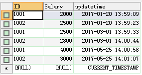
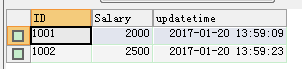
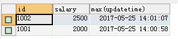
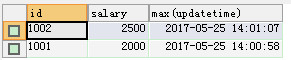
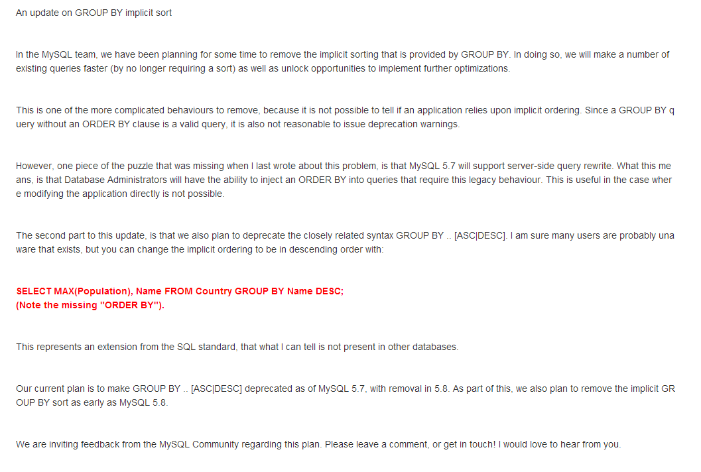

### 一、目标需求

假设我们有一张员工工资表，表里面存放了每个人的工资情况，包括历史的和最新的，我们现在要把每个人最新的工资是多少查出来。

### 二、建表

分别在mysql5.5和5.7新建test表并插入相同的测试数据。

```sql
CREATE TABLE `TEST` (
  `ID` varchar(10) NOT NULL COMMENT '员工号',
  `Salary` int(11) NOT NULL COMMENT '薪水',
  `updatetime` timestamp NOT NULL DEFAULT CURRENT_TIMESTAMP COMMENT '更新时间'
) ENGINE=MyISAM DEFAULT CHARSET=utf8;

insert  into `TEST`(`ID`,`Salary`,`updatetime`) values ('1001',2000,'2017-01-20 13:59:09');
insert  into `TEST`(`ID`,`Salary`,`updatetime`) values ('1002',2500,'2017-01-20 13:59:23');
insert  into `TEST`(`ID`,`Salary`,`updatetime`) values ('1001',2500,'2017-03-01 13:59:33');
insert  into `TEST`(`ID`,`Salary`,`updatetime`) values ('1002',2800,'2017-03-01 14:00:44');
insert  into `TEST`(`ID`,`Salary`,`updatetime`) values ('1001',4000,'2017-05-25 14:00:58');
insert  into `TEST`(`ID`,`Salary`,`updatetime`) values ('1002',3000,'2017-05-25 14:01:07');
```



### 三、查询

- 执行SQL：select * from (select * from TEST order by updatetime desc) a group by id;

	- mysql5.5查询结果（是我们想要的）：

<a href="/images/2017-05-25_144303.png"></a>

	- mysql5.7查询结果（不是我们想要的）：


- 执行SQL：select id,salary,max(updatetime) from TEST group by id desc;

	- mysql5.5查询结果（不是我们想要的）：


	- mysql5.7查询结果（不是我们想要的）：

<a href="/images/2017-05-25_151448.jpg"></a>


### 四、总结
在mysql5.5中我们可以利用子查询先排序再分组获得我们想要的结果，但是子查询会很慢，mysql5.7则对子查询做了优化，子查询排序不起作用，导致数据不正确，但是group by desc查出来也还是不对，比较坑爹，所以在5.7中只能先把最新的updatetime取出来，再用ID和updatetime去查salary，麻烦。

### 五、附件
官网更新说明：

